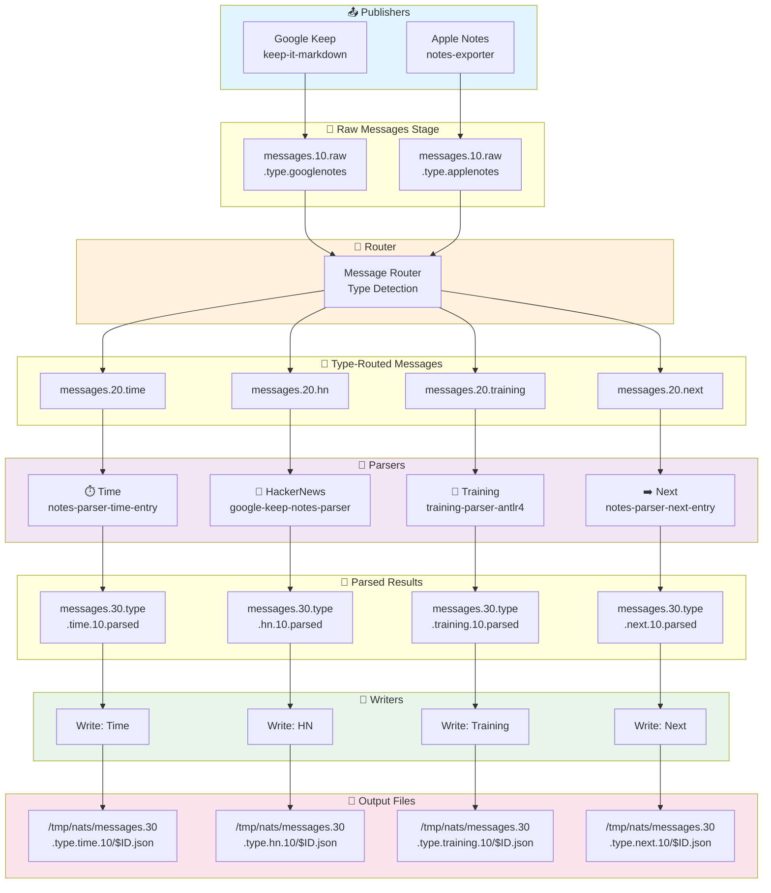

# Notes Router

Central routing and orchestration repository for the NATS-based notes processing pipeline.

This repository coordinates:
- **NATS infrastructure** — Configuration and schemas for message passing
- **Parsers** — Git submodules for specialized parsers (training, HackerNews, time, next)
- **Routers** — Python applications that route Google Keep and Apple Notes to appropriate parsers

## Architecture

### NATS Message Flow Diagram



### Pipeline Stages

| Stage | Component | Purpose |
|-------|-----------|---------|
| **1** | Publishers | Extract notes from Google Keep, Apple Notes, or any other source |
| **2** | NATS Topics | Distribute raw notes to router |
| **3** | Router | Detect message type and route to appropriate topic |
| **4** | NATS Topics | Topic-specific message queues (time, HN, training, next, or any other type) |
| **5** | Parsers | Parse and process content for specific types (or custom types) |
| **6** | NATS Topics | Store parsed results |
| **7** | Writers | Write parsed data to `/tmp/nats/$TOPIC/` |
| **8** | Files | JSON files organized by topic and ID |

## Folder Structure

```
notes-router/
├── infra/                         # Infrastructure & deployment
│   └── nats/                      # NATS server management
│       ├── Makefile              # NATS Docker orchestration (nats-up, nats-down, etc.)
│       ├── gen-certs.sh          # TLS certificate generation
│       └── nats-server.conf      # NATS mTLS configuration
│
├── importers/                     # Source data importers (git submodules)
│   ├── google-keep/              # Google Keep exporter (keep-it-markdown)
│   └── apple-notes/              # Apple Notes exporter (notes-exporter)
│
├── parsers/                       # Parser submodules (git submodules)
│   ├── training/                 # training-parser-antlr4
│   ├── hn/                        # google-keep-notes-parser (HN parser)
│   ├── time/                      # notes-parser-time-entry
│   └── next/                      # notes-parser-next-entry
│
├── routers/                       # Routing logic
│   ├── __init__.py
│   ├── google_notes_router.py    # Routes Google Keep notes to appropriate type topics
│   └── apple_notes_router.py     # Routes Apple Notes to appropriate type topics
│
├── Makefile                       # Root orchestration (delegates to infra/nats)
├── pyproject.toml                 # Python project configuration
└── README.md                      # This file
```

## Setup

### Prerequisites
- Python 3.9+
- Git with submodule support
- NATS server running

### Initialize

```bash
git clone --recurse-submodules https://github.com/alvarogarcia7/notes-router.git
cd notes-router
pip install -r requirements.txt
```

### Update submodules

Update all submodules to their latest remote commits:

```bash
# Update all submodules to latest remote
git submodule update --remote

# Or, more explicitly with recursive init
git submodule update --remote --recursive
```

Update specific submodules:

```bash
# Update a specific parser
git submodule update --remote parsers/time
git submodule update --remote parsers/hn
git submodule update --remote parsers/training
git submodule update --remote parsers/next

# Update a specific importer
git submodule update --remote importers/google-keep
git submodule update --remote importers/apple-notes
```

Initialize and update all submodules (after cloning without `--recurse-submodules`):

```bash
git submodule update --init --recursive
```

Check submodule status:

```bash
git submodule status
```

Pull latest changes from all submodules:

```bash
git pull --recurse-submodules
```

## Running

### Start NATS
```bash
docker run -p 4222:4222 nats:latest
```

### Start Routers
```bash
python routers/google_notes_router.py
python routers/apple_notes_router.py
```

### Start Parsers
See individual parser repositories for instructions.

## NATS Topics

### Stage 1: Publishers
- `messages.10.raw.type.googlenotes` — Google Keep notes
- `messages.10.raw.type.applenotes` — Apple Notes

### Stage 2: Routers
- `messages.20.time` — Time entries
- `messages.20.hn` — HackerNews items
- `messages.20.training` — Training sessions
- `messages.20.next` — Next entries
- `messages.20.other.*` — Generic content (source-specific)

### Stage 3: Parsers & Writers
- `messages.30.type.time.10.parsed`
- `messages.30.type.hn.10.parsed`
- `messages.30.type.training.10.parsed`
- `messages.30.type.next.10.parsed`

## Related Repositories

- [google-keep-notes-parser](https://github.com/alvarogarcia7/google-keep-notes-parser) — Publisher & HN parser
- [notes-exporter](https://github.com/alvarogarcia7/notes-exporter) — Apple Notes publisher
- [training-parser-antlr4](https://github.com/alvarogarcia7/training-parser-antlr4) — Training parser
- [time-entry-notes-parser](https://github.com/alvarogarcia7/notes-parser-time-entry) — Time parser
- [notes-parser-next-entry](https://github.com/alvarogarcia7/notes-parser-next-entry) — Next entry parser
